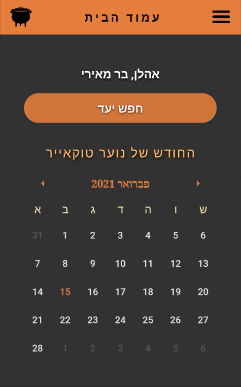

# Hostish
A social travel app for Israeli youth groups built with React Native

This app is built using:
* ES6
* Firebase
* Expo
  
# Screenshots

  
  
  
  
  
  
  
  

# License
Hostish Code Viewing License (HVCL)
Permission is hereby granted, free of charge, to any person obtaining a copy of this software and associated documentation files (the "Code"), to view the Code solely for the purpose of understanding its implementation and functionality.
No other rights are granted regarding the Code, including but not limited to the rights to use, modify, distribute, sublicense, or sell copies of the Code.
Any use, modification, distribution, or sublicensing of the Code, in whole or in part, without explicit prior written permission from the owner (Meishar Tal), is strictly prohibited.
THE CODE IS PROVIDED "AS IS", WITHOUT WARRANTY OF ANY KIND, EXPRESS OR IMPLIED, INCLUDING BUT NOT LIMITED TO THE WARRANTIES OF MERCHANTABILITY, FITNESS FOR A PARTICULAR PURPOSE AND NONINFRINGEMENT. IN NO EVENT SHALL THE AUTHORS OR COPYRIGHT HOLDERS BE LIABLE FOR ANY CLAIM, DAMAGES OR OTHER LIABILITY, WHETHER IN AN ACTION OF CONTRACT, TORT OR OTHERWISE, ARISING FROM, OUT OF OR IN CONNECTION WITH THE CODE OR THE USE OR OTHER DEALINGS IN THE CODE.
If you have any questions or would like to inquire about licensing or usage rights, please contact [Meishar Tal](mailto:meta704@gmail.com).
